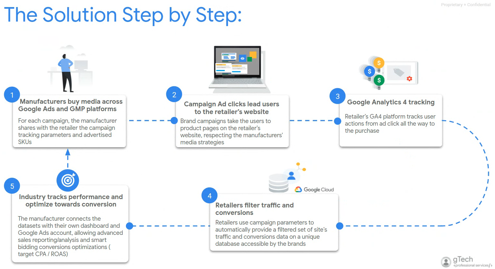

# Co-op4All

Co-op4All is a platform to run co-marketing campaigns between brands and retailers, providing campaign performance dashboards and smart bidding optimization capabilities (offline conversions).

***Disclaimer: Co-op4All is not an officially supported Google product.***

## License

Copyright 2021 Google LLC

Licensed under the Apache License, Version 2.0 (the "License"); you may not use
this file except in compliance with the License. You may obtain a copy of the
License at

http://www.apache.org/licenses/LICENSE-2.0

Unless required by applicable law or agreed to in writing, software distributed
under the License is distributed on an "AS IS" BASIS, WITHOUT WARRANTIES OR
CONDITIONS OF ANY KIND, either express or implied. See the License for the
specific language governing permissions and limitations under the License.

***Note that this solution is not an official Google product and
is not formally supported.***

  - [1. How does it work?](#1-how-does-it-work)
  - [2. Requirements](#2-requirements)
    - [2.1. APIs](#21-apis)
  - [3. Supported Offline Conversion Import Integrations](#3-supported-offline-conversion-import-integrations)
  - [4. Configure the OAuth Screen](#4-configure-the-oauth-screen)
  - [5. Deployment](#5-deployment)
  - [6. Secure the App using Identity Aware Proxy](#6-secure-the-app-using-identity-aware-proxy)
  - [Additional Information](#additional-information)
    - [Get the Identity Aware Proxy Client Id](#get-the-identity-aware-proxy-client-id)
    - [Grant permissions to the App Engine default service account](#grant-permissions-to-the-app-engine-default-service-account)
    - [Deploy each service individually](#deploy-each-service-individually)

## 1. How does it work?



## 2. Requirements

* For Manufactures
    - Media team
    - Data Studio
    - Auto-tagging enabled
    - Google Ads access
    - Campaign Manager / DV360 access

* For Retailers
    - Tech team
    - Google Cloud Platform
        - Billing enabled
        - App Engine
        - BigQuery
        - Cloud Scheduler
        - Secret Manager
    - Google Analytics 4
        - Enhanced Ecommerce enabled
    - Google Ads access
    - Campaign Manager / DV360 access

### 2.1. APIs
- Google Ads
- Campaign Manager
- Datastore
- BigQuery

## 3. Supported Offline Conversion Import Integrations
- Google Ads Offline Conversions Import using **gclid** [[details]](https://support.google.com/google-ads/answer/2998031?hl=en)
- Campaign Manager / DV360 Offline Conversions Import using **dclid** [[details]](https://support.google.com/searchads/answer/7384231?hl=en)

## 4. Configure the OAuth Consent Screen

1. Access the Google Cloud console.
2. Go to the **API & Services** option on the top-left menu.
3. Select the **OAuth consent screen** option and configure the **consent screen**. In the **User type** option select **External** and click **Create**.
4. Assign a name to the application, it can be **Coop4All**, and complete all the other required fields.
5. Accept all the defaults and click on **Save and Continue** and then **Back to Dashboard**.

## 5. Deployment

This guide assumes that the instructions will be followed inside Google Cloud Platform shell console.

1. Open a Google Cloud shell console.
2. Check the Node version using ```node -v```. Make sure it is greater or equal than 16.10.0.
  - Use nvm to install the Node version, execute ```nvm install 16.10.0```. Details about nvm [here](https://github.com/nvm-sh/nvm)
3. Clone the Co-op4All repository ```git clone https://github.com/google/co-op-4-all.git ```
4. Go to the root folder and execute the ```deploy.sh``` script using ```bash deploy.sh``` or ```./deploy.sh```. Please provide all the required parameters for the script to start. The IAP client id will be requested later, after the App Engine app has been deployed.
    * The deployment script will deploy the services and cron jobs described below. It will also enable the required APIs for each service.
        - *Default Service* - The web UI
        - *The API Service* - The service handling all the backend calls for CRUD and processing operations.
            - Cron job to execute the **update_all_configs** - a daily cron to update all the co-op campaign configurations.
            - Cron job to execute the **push_dv360_cm_conversions** - a daily cron to push the offline conversions to CM/DV360.
        - *The Proxy Service* - The service handling the Google Ads Offline Conversions Import. Since the **Scheduled Import** is configured directly in Google Ads, this endpoint needs to be open using a proxy so the conversions can be pulled from the Google Ads platform.
5. Wait for the script to finish, it might take up to 10 minutes.
   - In case of any errors, run the specific commands manually to fix them. Please check how to deploy each service individually in the section [below](#deploy-each-service-individually).
   - At some point the IAP Client Id will be required, please follow the steps in the section [below](#get-the-identity-aware-proxy-client-id) to get it. If there is an error in the IAP page saying that the client id is misconfigured, please follow the steps in the UI to fix it.
6. After the deployment is ready, go to the **App Engine** page to verify the deployed UI in the **Dashboard** option
from the menu, then click on the URL at the top (project-id.uc.r.appspot.com). You should see the following message in the UI: *Retailers not found*.
   - If a parsing error is displayed, wait at least 5 minutes for App Engine to update and finish the deployment setup, then refresh the UI.

## 6. Secure the App using Identity Aware Proxy

The solution uses [Identity Aware Proxy](https://cloud.google.com/iap/docs/concepts-overview) in order to control access to the web UI and the services. Users need to be added with a specific role to be able to access the resources.

Follow the steps below to close the application and create users.

1. Go to the **IAM** page in Google Cloud.
2. Click on the **Add** button at the top to add a new user.
3. Type the user's email and then select the **IAP-secured Web App User** role.
   - It is important to also add the email of the user deploying the solution (in case the deployment script failed to do so), even if they are owner of the project.
4. Repeat the steps 2 and 3 for other users.
5. Go to the **IAP page** and now close the application by toggling (if not done yet) the **IAP** option next to the **App Engine App** collapsible menu.
6. Now all the services will be closed using IAP, but the Google Ads proxy service needs to be open
in order to work for the Offline Conversions Import setup in the Google Ads platform.
To open the Google Ads proxy service, select the **checkbox** next to the **ads-conversion-proxy** service and add a new user using the menu on the right.
Click on the **Add principal** button, and type **allUsers**, then select the **IAP-secured Web App User** role and click **Save**.
   - The changes might take approximately 5 mins to take effect.

## Additional Information

### Get the Identity Aware Proxy Client Id

1. Search for the **Identity Aware Proxy** page on the top search bar.
2. Find the **App Engine app** menu under the **All Web Services** collapsible menu.
3. Click on the 3 dots menu to the right, next to the **App Engine app** collapsible menu.
4. Click on the **Go to OAuth configuration** button. The Client Id will be displayed.
5. Copy and save the Client Id.

### Grant permissions to the App Engine default service account

It is highly recommended that the Co-op4All solution is installed in a new Google Cloud project, so it is required that the App Engine default service account (created during installation in step #5) has access to the BigQuery Export tables, those tables will most likely be on a different project. The deployment script will take care of this access, in case of any errors grant the access manually following the steps below.

1. Go to the project that contains the BigQuery Export, find the dataset with the data and click on the 3 dots menu.
2. Then, click on the **Share** button and then on the **Add principal** button.
3. Add the service account email and then select the **BigQuery Data Viewer** role and save.
   - The App Engine default service account email can be found in the **Service Accounts** page of the project where the solution was deployed.
   - This access can also be granted at project level directly in the **IAM** page.

### Deploy each service individually

In case of any errors or **code update**, each service can be deployed individually using the gcloud commands below.

   - Deploy the **default** frontend service - ```gcloud app deploy frontend.yaml```
     - IMPORTANT: build the Angular files using ```ng build --configuration=production``` before deploying the frontend.
   - Deploy the **api-service** - API for CRUD and processing operations - ```gcloud app deploy backend.yaml```
   - Deploy the **ads-conversions-proxy** service - Proxy to retrieve the Google Ads Conversions - ```gcloud app deploy proxy.yaml```
     - IMPORTANT: Replace the IAP_CLIENT_ID in the proxy.yaml file before deploying the proxy.
   - Deploy the dispatch ```gcloud app deploy dispatch.yaml``` to redirect the requests to the correct service.
     - IMPORTANT: After deploying a new version of a service, always run this command.
   - Deploy the crons ```gcloud app deploy cron.yaml```

### Note about data expiration in the BQ tables

In order to reduce Google Cloud costs, the **all_transactions** and **all_clicks** BQ tables have an expiration time of 90 days by default, which means that the data is going to be deleted after 90 days. The expiration for the tables can be configured when creating a Retailer in the App Engine UI. The expiration days configuration is the **Co-op Max Backfill** field in the Retailers tab and it has a time range of 30-180 days. It is recommended to create a backup if the data will be used after this period.
Keep in mind that the retailers cannot be modified after creation, so please verify this value before creating a retailer or the retailer would need to be removed and re-created.